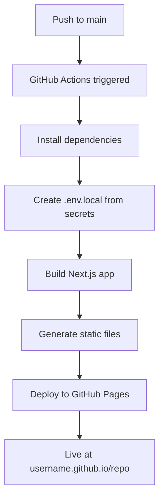

# 🎉 GitHub Pages Deployment - COMPLETE!

## ✅ What We've Built

Your Quantii POS system is now **fully configured** for GitHub Pages deployment with Firebase integration!

### 🔧 Technical Setup Complete

1. **Static Export Configuration** ✅
   - `next.config.mjs` configured for GitHub Pages
   - Static file generation in `out/` directory
   - Proper asset paths and base paths

2. **Firebase Integration** ✅
   - Firebase SDK installed and configured
   - Firestore services for inventory & transactions
   - Real-time listeners with offline fallback
   - Environment variable support

3. **GitHub Actions Workflow** ✅
   - Automated build and deployment
   - Environment secrets injection
   - GitHub Pages deployment configured

4. **Configuration Management** ✅
   - Smart config system with fallbacks
   - Environment variable detection
   - Demo mode for testing

### 📁 Files Created/Modified

**New Files:**
- `DEPLOYMENT.md` - Complete deployment guide
- `QUICK_DEPLOY.md` - 5-step deployment guide
- `deploy-check.sh` - Pre-deployment verification script
- `src/lib/config.js` - Configuration management

**Modified Files:**
- `.github/workflows/deploy.yml` - Added environment injection
- `src/lib/firebase.js` - Updated to use config system
- `src/app/page.js` - Updated to use config system

## 🚀 How GitHub Pages Works with Your App

### Environment Variables Solution

**The Challenge:** GitHub Pages can't access environment variables at runtime.

**Our Solution:**
1. GitHub Actions reads secrets during build
2. Creates `.env.local` file with your Firebase config
3. Next.js embeds these values into the static JavaScript bundle
4. Your app works with Firebase on GitHub Pages!

### Security

✅ **Safe:** Firebase config is meant to be public
✅ **Secure:** Protected by Firestore security rules
✅ **Controlled:** API key restricted to your domains

## 🎯 Deployment Process



## 📋 Next Steps for You

### 1. Firebase Setup (Required)
```bash
# Follow the guide
open FIREBASE_SETUP.md
```

### 2. GitHub Secrets (Required)
- Repository → Settings → Secrets → Actions
- Add your Firebase configuration secrets

### 3. Deploy (Easy!)
```bash
git add .
git commit -m "Deploy POS system"
git push origin main
```

### 4. Verify (Optional but recommended)
```bash
./deploy-check.sh
```

## 🌟 Features Your Deployed App Will Have

- ☁️ **Cloud Database**: All data stored in Firebase
- 🔄 **Real-time Sync**: Live updates across devices
- 📱 **Mobile Responsive**: Works on phones, tablets, desktop
- 🔐 **Secure**: Key-based authentication
- 💾 **Persistent**: Data survives browser restarts
- 🌐 **Public Access**: Share with your team
- 📊 **Analytics Ready**: Easy to add Firebase Analytics

## 💡 Alternative Hosting Options

**Vercel** (Recommended):
- Automatic deployments
- Built-in environment variables
- Excellent Next.js support

**Netlify**:
- GitHub integration
- Environment variable support
- Free tier available

**Self-hosted**:
- Build locally: `npm run build`
- Upload `out/` folder to any web server

## 🆘 Troubleshooting

### Common Issues & Solutions

1. **Build Fails**
   - Check GitHub secrets are configured correctly
   - Verify Firebase project settings

2. **404 on GitHub Pages**
   - Ensure Pages source is "GitHub Actions"
   - Check repository is public or has GitHub Pages enabled

3. **Firebase Connection Issues**
   - Verify Firestore security rules
   - Check Firebase project is active

4. **App Won't Load**
   - Check browser console for errors
   - Verify all secrets are added to GitHub

### Get Help
- Check `DEPLOYMENT.md` for detailed guides
- Run `./deploy-check.sh` to verify setup
- Review build logs in GitHub Actions

## 🎊 Congratulations!

Your POS system is ready for production deployment. The combination of Next.js, Firebase, and GitHub Pages gives you:

- **$0 hosting costs** (free tiers)
- **Professional infrastructure** (Google & GitHub)
- **Scalable architecture** (handles growth)
- **Modern developer experience** (Git-based deployments)

Deploy with confidence! 🚀
